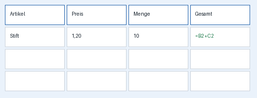

titel: Beispielkurs – Excel Grundlagen
design: d2l
fuss: Datenverarbeitung · Beispielschule

# Lektion 1 – Erste Formeln
beschreibung: Summe, Mittelwert, Min und Max – und was eine Formel überhaupt ist.

## Seite: Einstieg: Was ist eine Formel?
kurz: Input 1 · ca. 10 Minuten gemeinsam

::: ziel
Am Ende der Stunde kannst du eine Tabelle mit **Formeln** rechnen lassen und weißt, warum `=` das wichtigste Zeichen in Excel ist.
:::

## Formel oder Text?

Excel unterscheidet zwei Dinge in einer Zelle:

| Du tippst | Excel sieht | Ergebnis |
|---|---|---|
| `12` | eine Zahl | 12 |
| `Hallo` | einen Text | Hallo |
| `=3+4` | eine **Formel** | 7 |
| `3+4` | einen Text (kein `=`!) | 3+4 |



::: merke Das Wichtigste
Jede Formel beginnt mit **=**. Ohne `=` rechnet Excel nichts.
:::

::: input Input 1 · Vier Funktionen
1. `=SUMME(B2:B6)` – zählt alle Werte zusammen
2. `=MITTELWERT(B2:B6)` – Durchschnitt
3. `=MIN(B2:B6)` – kleinster Wert
4. `=MAX(B2:B6)` – größter Wert

Der Doppelpunkt heißt **„bis"**: `B2:B6` sind die Zellen B2, B3, B4, B5 und B6.
:::

::: auftrag Arbeitsauftrag 1 · ca. 20 Minuten
Öffne `Uebung.xlsx`, Blatt **Verkaeufe**.

- [ ] In **B12** die Summe aller Verkäufe
- [ ] In **B13** den Mittelwert
- [ ] In **B14** den kleinsten Wert
- [ ] In **B15** den größten Wert

Kontrollwert für B12: **1.284**
:::

::: lösung
```
B12: =SUMME(B2:B11)
B13: =MITTELWERT(B2:B11)
B14: =MIN(B2:B11)
B15: =MAX(B2:B11)
```
:::

::: achtung
Wenn in der Zelle `#NAME?` steht, ist der Funktionsname falsch geschrieben. `SUMME`, nicht `SUM` – die deutsche Version von Excel will deutsche Namen.
:::

### Quiz: Selbstcheck – hast du's?
Womit beginnt jede Formel? (2 P)
- [x] mit =
- [ ] mit +
- [ ] mit einem Buchstaben
> Richtig: Genau, ohne = rechnet Excel nichts.
> Falsch: Schau noch mal in den Merke-Kasten.

`B2:B6` bedeutet „B2 bis B6".
- [x] Wahr
- [ ] Falsch

Welche Funktionen gibt es wirklich in Excel? (2 P)
- [x] SUMME
- [x] MITTELWERT
- [ ] DURCHSCHNITT
- [ ] ZUSAMMEN

Wie heißt die Funktion für den größten Wert?
= MAX
= =MAX

::: geschafft
- du hast vier Formeln in B12 bis B15
- der Kontrollwert 1.284 stimmt
- du hast den Selbstcheck gemacht
:::

::: extra
Ergänze in **B16** die Anzahl der Verkäufe mit `=ANZAHL(B2:B11)`. Was passiert, wenn du eine Zahl löschst?
:::

## Datei: material/Uebung.xlsx
titel: Uebung.xlsx (Trainingsdatei)

## Link: Microsoft-Hilfe zu SUMME
url: https://support.microsoft.com/de-de/office/summe-funktion-043e1c7d-7726-4e80-8f32-07b23e057f89

## Abgabe: Abgabe 1 – Verkaufstabelle
punkte: 10
faellig: 15.10.2026

Lade deine fertige **Uebung.xlsx** hoch. Bewertet werden:

- vier richtige Formeln (je 2 Punkte)
- Kontrollwert stimmt (2 Punkte)

# Lektion 2 – Bezüge
beschreibung: Relative und absolute Bezüge, das Dollarzeichen.

## Seite: Input: Das Dollarzeichen
kurz: Input 2 · ca. 10 Minuten

Wenn du eine Formel nach unten ziehst, wandern die Zellbezüge mit. Das ist meistens gewollt – außer bei einer Zelle, die **immer gleich bleiben** soll, zum Beispiel dem Mehrwertsteuersatz in **E1**.

::: beispiel
| Formel in C2 | nach unten gezogen in C3 |
|---|---|
| `=B2*E1` | `=B3*E2` ← falsch, E2 ist leer |
| `=B2*$E$1` | `=B3*$E$1` ← richtig |
:::

::: merke
`$E$1` heißt: **Spalte E und Zeile 1 festhalten.** Taste [[F4]] setzt die Dollarzeichen.
:::

::: hinweis Tipp
Erst die Formel ohne `$` schreiben, dann in die Zelle klicken und [[F4]] drücken.
:::

## Quiz: Abschlussquiz Lektion 1+2
benotet: ja
versuche: 2

Zehn Minuten, zwei Versuche. Der bessere zählt.

Was bedeutet `$E$1`? (2 P)
- [x] Die Zelle E1 bleibt beim Ziehen fest
- [ ] Der Wert in E1 ist in Euro
- [ ] E1 wird gelöscht

`=SUMME(B2:B6)` zählt fünf Zellen zusammen.
- [x] Wahr
- [ ] Falsch

Welche Taste setzt die Dollarzeichen?
= F4

## Note: Mitarbeit Lektionen 1–2
punkte: 10
